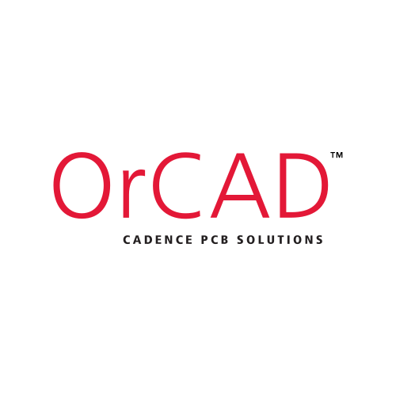

# **Hi there** , I'm **Henry** (**hungry5656**)

```

██╗  ██╗██╗   ██╗███╗   ██╗ ██████╗ ██████╗ ██╗   ██╗███████╗ ██████╗ ███████╗ ██████╗ 
██║  ██║██║   ██║████╗  ██║██╔════╝ ██╔══██╗╚██╗ ██╔╝██╔════╝██╔════╝ ██╔════╝██╔════╝ 
███████║██║   ██║██╔██╗ ██║██║  ███╗██████╔╝ ╚████╔╝ ███████╗███████╗ ███████╗███████╗ 
██╔══██║██║   ██║██║╚██╗██║██║   ██║██╔══██╗  ╚██╔╝  ╚════██║██╔═══██╗╚════██║██╔═══██╗
██║  ██║╚██████╔╝██║ ╚████║╚██████╔╝██║  ██║   ██║   ███████║╚██████╔╝███████║╚██████╔╝
╚═╝  ╚═╝ ╚═════╝ ╚═╝  ╚═══╝ ╚═════╝ ╚═╝  ╚═╝   ╚═╝   ╚══════╝ ╚═════╝ ╚══════╝ ╚═════╝ 
                                                                                       
```

## I'm a third year student studying **CSE** at **UCDavis**

- 📝 I'm currenty working on my personal **[website]**!
- 🌱 I'm currently learning *shell* programming and *sklearn/pandas/tensorflow* python packages.
- 🚩 2023 Goals:
- - 🔲 Finish my website 🌐
- - 🔲 try to do some projects 📂
- 👀 Fun Fact: I love **Batman🦇**, **guitar🎸** and wanna try **Archery🏹**.
- 🏃 Sports I love: **Cycling🚴**, **Badminton🏸**, **Basketball🏀**, **Formula 1🏎️🏁**

### Connect with me

[][Instagram]
[][Linkedin]
[][Twitter]
[][Stack-Overflow]


### Languages
<!-- svg source website -->

[](http://www.open-std.org/jtc1/sc22/wg14/)
[](https://isocpp.org/)
[](https://www.python.org/)
[](https://www.mathworks.com/)
[](https://en.wikipedia.org/wiki/SystemVerilog)
[](https://www.haskell.org/)
[](https://www.swi-prolog.org/)
[](https://www.erlang.org/)
[](https://html.spec.whatwg.org/)
[](https://www.w3.org/TR/CSS/#css)
[](https://docs.microsoft.com/en-us/dotnet/visual-basic/)
[](https://en.wikipedia.org/wiki/SystemVerilog)


<br>

### Tools
[](https://git-scm.com/)
[](https://www.linux.org/)
[](https://www.gnu.org/software/bash/)
[](https://github.com/)
[](https://code.visualstudio.com/)
[](https://www.anaconda.com/)
[](https://www.orcad.com/)


[website]: https://www.hungry5656.com
[Twitter]: https://twitter.com/hungry5656
[Instagram]: https://instagram.com/hungry5656_
[Linkedin]: https://www.linkedin.com/in/sizhuo-sun-8529541b2/
[Stack-Overflow]: https://stackoverflow.com/users/11640053/
